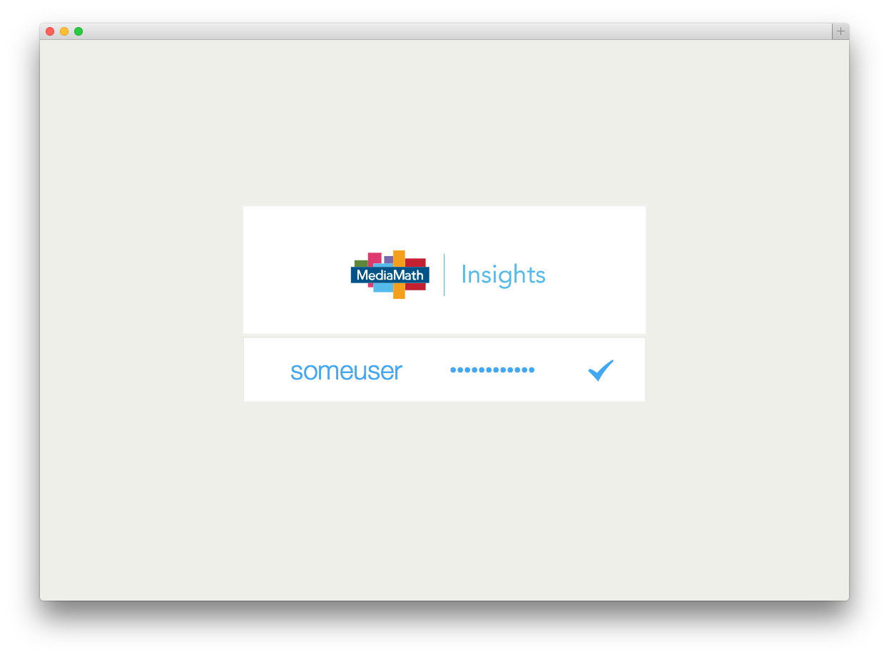
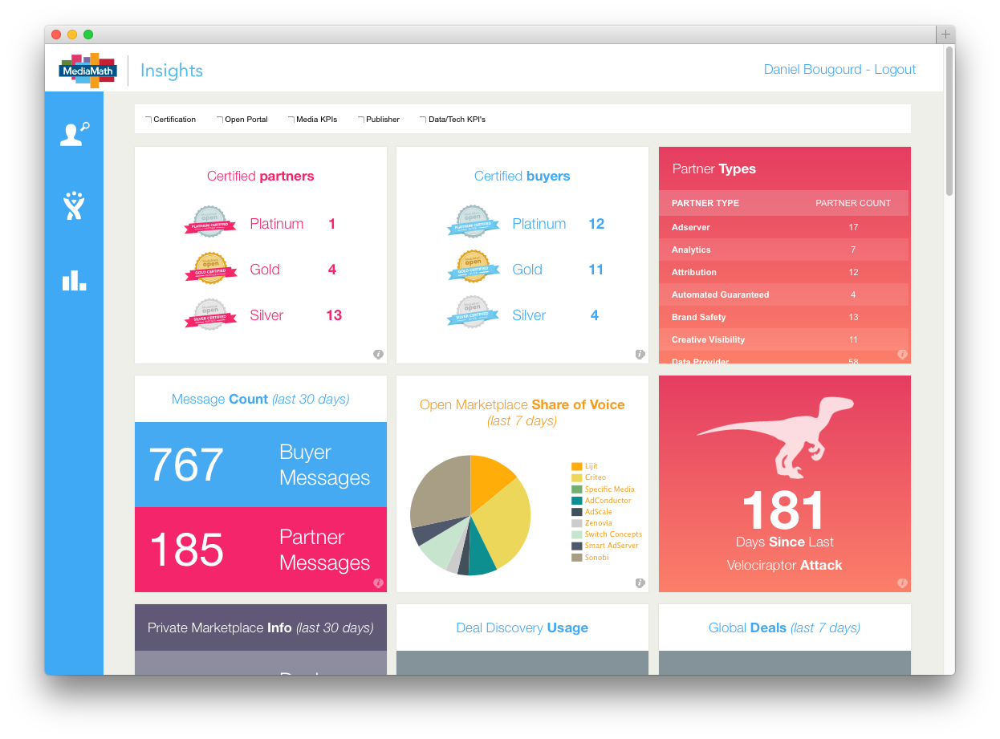
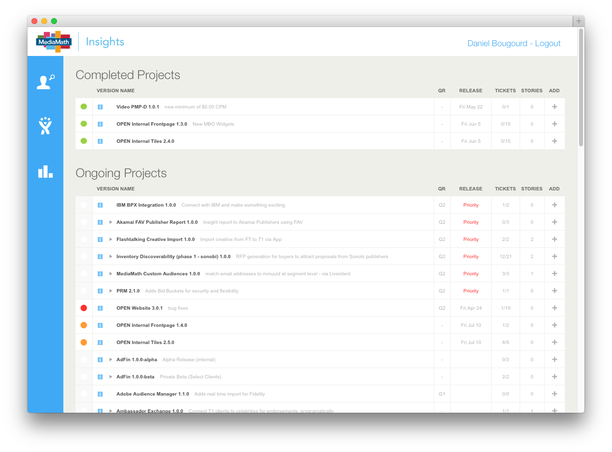
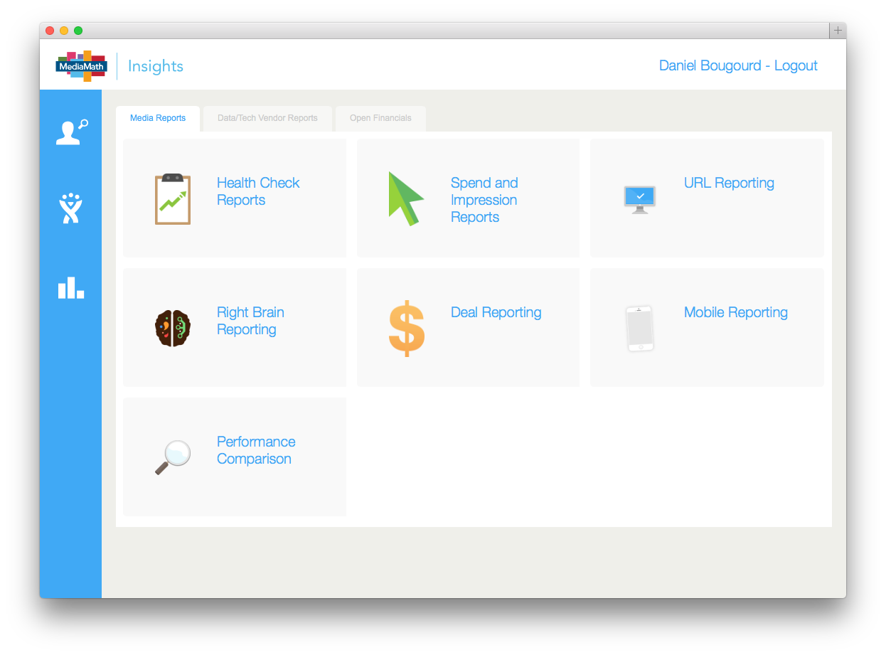
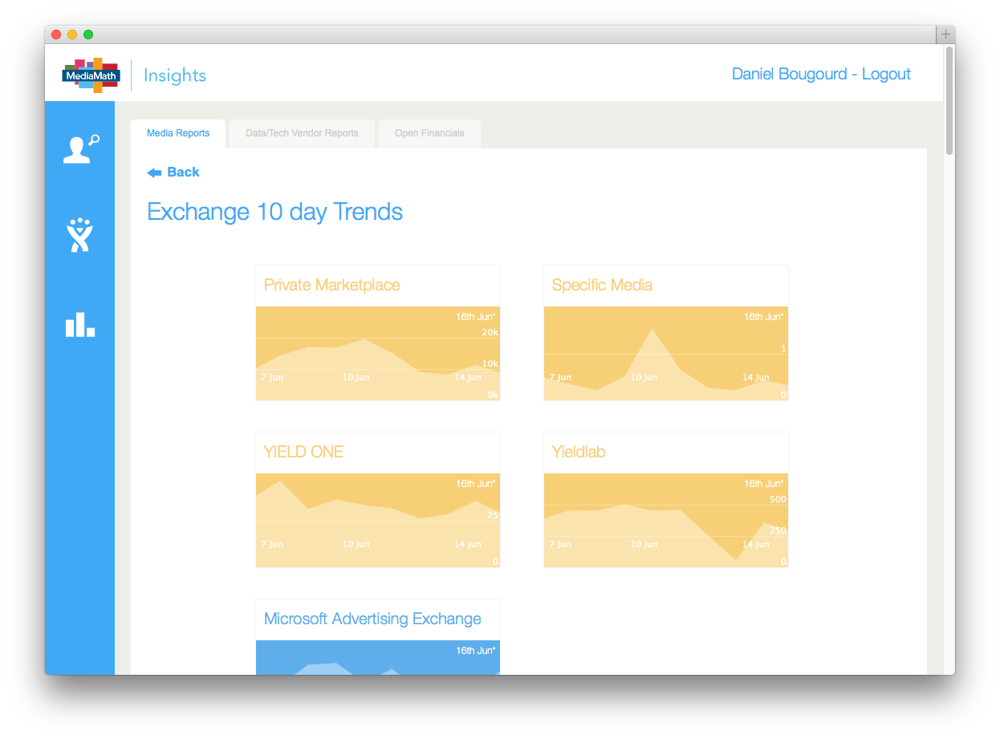

Insights
==================


# Overview

**Login (Employees Only):**



**Widgets:**



**OPEN Development Roadmap:**



**Reporting Tiles:**






## Laravel PHP Framework

[](https://travis-ci.org/laravel/framework)
[](https://packagist.org/packages/laravel/framework)
[](https://packagist.org/packages/laravel/framework)
[](https://packagist.org/packages/laravel/framework)
[](https://packagist.org/packages/laravel/framework)

Laravel is a web application framework with expressive, elegant syntax. We believe development must be an enjoyable, creative experience to be truly fulfilling. Laravel attempts to take the pain out of development by easing common tasks used in the majority of web projects, such as authentication, routing, sessions, and caching.

Laravel aims to make the development process a pleasing one for the developer without sacrificing application functionality. Happy developers make the best code. To this end, we've attempted to combine the very best of what we have seen in other web frameworks, including frameworks implemented in other languages, such as Ruby on Rails, ASP.NET MVC, and Sinatra.

Laravel is accessible, yet powerful, providing powerful tools needed for large, robust applications. A superb inversion of control container, expressive migration system, and tightly integrated unit testing support give you the tools you need to build any application with which you are tasked.

## Official Documentation

Documentation for the entire framework can be found on the [Laravel website](http://laravel.com/docs).

### Contributing To Laravel

**All issues and pull requests should be filed on the [laravel/framework](http://github.com/laravel/framework) repository.**

### License

The Laravel framework is open-sourced software licensed under the [MIT license](http://opensource.org/licenses/MIT)


# Artisan Tips for Insights

To run the useful options the Artisan is neccesary to follow these 3 steps


1) Login to machine (production, development, staging, testing, local, so on)

>$ ssh user@ip_machine


2) Move to the folder path of the Insights repo

>$ cd /path/to/insights


3) Now you can run it

>$ php artisan command_line_option


e.g:

>$ php artisan cache:clear


Most common command line options
>    cache:clear -> Flush the application cache, Laravel's oprtion

>    dump-autoload -> Regenerate framework autoload files, to reload when we pull new Clasess, Laravel's oprtion

>    generate:config_file_reports -> CLI generator of config file by categories for reports.

>    command:cacheCommand clear_all -> CLI to help to clean all cache, and temporal files.


To see the full list you must run "php artisan" and you will be able to see that in the terminal
>$ php artisan


# Queues

Dependencies [Beanstalkd](http://kr.github.io/beanstalkd) and [Supervisord](http://supervisord.org/)


## Beanstalkd

Install [Beanstalkd](http://kr.github.io/beanstalkd/download.html):

>$ sudo apt-get install beanstalkd

Start Beanstalkd when the system starts up or reboots:

>$ sudo vim /etc/default/beanstalkd

> \> START yes     # uncomment

Then start Beanstalkd:
>$ sudo service beanstalkd start


## Supervisord

Install [Supervisord](http://supervisord.org/):

>$ sudo apt-get install supervisor

Configure it:

>$ sudo vim /etc/supervisor/conf.d/myqueue.conf

>    \[program:myqueue\]

>    command=php artisan queue:work --daemon --env=your_environment

>    directory=/path/to/laravel

>    stdout_logfile=/path/to/laravel/app/storage/logs/myqueue_supervisord.log

>    redirect_stderr=true

>    autostart=true

>    autorestart=true

Tell Supervisord to start and monitor our queue:

>$ sudo supervisorctl

>  \> reread # Tell supervisord to check for new items in /etc/supervisor/conf.d/

>  \> add myqueue       # Add this process to Supervisord

>  \> start myqueue     # May say "already started"


\* All command lines examples are for Debian/Ubuntu example


# Standard Reports (Tile)


## Requirements

Permission to the config folder

## Basic

The report menu comes from the config file /path/to/reports/report.php.

This is a temporal file and we must not overwrite it, to created this we must added the relation in dashboard database.

## Generate Report Config File

To generate the file or update after added a row in the table we must to run MenuReportCommand (Laravel CLI).

>$ php artisan generate:config_file_reports


## Create a new Report

### Config about the report Page in database

>  Go to conecction dashboard database

>  Add a new row in 'reports' table.

>  Add the relation with categorization in 'report_category' table, if doesn't exist category create a new one in 'categories' table first.

>  Add the relation with roles in 'report_role' table(*), if doesn't exist the role crate a new one in 'roles' table first.

>  Add the display, model name[s] are going to be deployed in the page, in 'report_display' table.

\* If the report doesn't have one role the system is going to show only for Insights Team


### Route and Controller

*The routes are going to be called in /url/to/analytics/category/subcategory/indexReport/reportId, see /path/to/app/routes.php

*NavigationController is responsible for the navigation and response of the views

*ReportsController is responsible to return the wrapper with filters and data

*Anothers controller involve in the load page: DownloadController, TrackController, SearchReportsController


### Create a model

>  Add a new model to /path/to/models/reports/ that extends from Tile

>  Tile class is abstract and you must implemented 'options', 'filters', 'setQuery' methods and you must asigned values to the properties 'col', 'table'.

>  After added a new model if neccesary run: $ php artisan dump-autoload

>  But after changed the structure is necessary 'update'


e.x. /path/to/models/Report/folder/Foo.php


```PHP
<?php

class Foo extends Tile
{
	/**
	 * Holds configuration settings for each item in the model.
	 *
	 * array['col']    array Defines the fields in the query.
	 *     [view]           string Name show in the view
	 *     ['fieldName']    string Select expresion
	 *     ['fieldAlias']   string Overrides the name of the select expresion
	 *     ['group']        boolean If is going to be aggregate
	 *     ['gDependence']  boolean Only in false if the result doesn't have dependece in index
	 *                      |
	 *                      string Raw name of the field need to be aggregate in group for index optimization
	 *     ['join']         boolean Only in false if the field is not going to have join
	 *                      |
	 *                      array Information of the join structure
	 *                         ['type'] string Join condition option: INNER | LEFT | RIGHT | NATURAL
	 *                         ['tableName'] string Table Name and alias
	 *                         ['tableAlias'] string Alias asigned in the table Name
	 *                         ['fieldA'] string First Field is going to apper in the ON
	 *                         ['joinAlias'] string Alias to the reference
	 *                         ['fieldB'] string Second field is going to apper in the ON
	 *     ['format']       boolean Only in false if the field is going to be string result
	 *                      |
	 *                      string Formatting options for field: number | money | decimal | percentage
	 *                        | percentage2 | percentage5 | percentage3 | wow | ordinal | month | shortMonth
	 *                        | toPercentage | million | seconds | hoursDay | gap
	 *     ['order']        boolean Only in false if the result is going to be order by default
	 *                      |
	 *                      string Ordering options for field: ASC | DESC
	 *     ['total']        boolean Calculate the total with aggregates, joins, where, order, but not expresions
	 *     ['noInQuery']    boolean True prevents add the field in query builder but leave the user manipulate the field in a custom method
	 *
	 * @param array $arr (See above)
	 * @return Object A new editor object.
	 **/
	public $col = [
		'COUNTRY' => [
			'view' => 'Country',
			'fieldName' => 'a.COUNTRY',
			'fieldAlias' => 'COUNTRY',
			'group' => false,
			'gDependence' => 'a.COUNTRY_ID',
			'join' => false,
			'format' => false,
			'order' => false,
			'total' => false
		],
		'TOTAL' => [
			'view' => 'Total',
			'fieldName' => 'count(*)',
			'fieldAlias' => 'TOTAL',
			'group' => true,
			'join' => false,
			'format' => false,
			'order' => false,
			'total' => false
		]
	];

	/**
	 * string Defines the connection to database, by default analytics
	 **/
	protected $conn = 'name_connection_to_database';
	/**
	 * string Defines the main Table name [alias]
	 **/
	protected $from = 'table a';

	/**
	 * Option configuration for the view
	 *
	 * array['options']    array Defines the fields in the query.
	 *     ['total']             boolean False doesn't show head row for total in table
	 *     ['scrollY']           string Customise the scroll Y e.g '1480px'
	 *                           | boolean By default true and shows size in css
	 *     ['pagination']        boolean Option show buttom more and activate limit to 100 by default
	 *     ['type']              array Name types for this report, by default ['table']
	 *                              | [table | export | download | chart-area | chart-column | small-table | chart-pie
	 *                              | chart-line | mix]
	 *     ['filters']           array with parameter received
	 *                           | boolean False if there are not going to be filters
	 *     ['uniqueFilter']      array If there one of the filter item is not going to be multiselect, empty by default
	 *     ['hide']              array if in one specific View type we want to hide a filter
	 *                             e.x. ['chart-line' => ['Country']],
	 *     ['date_picker']       array start and end item must call to Format::datePicker(X) by default day
	 *                             X argument: 0 today, 1 yesterday, 2 before yesterday, so on.
	 *                           | boolean False if there is not going to be date filter
	 *     ['search']            boolean False prevents show Search option in page
	 *     ['download']          boolean False prevents show Download buttom in page
	 *     ['group']             int For manipulation of group in DataTable Jquery plugin option
	 *                           | boolean By default false
	 *     ['order']             array Relate to group option e.x. [[1, 'desc']]
	 *     ['column_selector']   boolean by default False, DataTable Jquery plugin option
	 *     ['range_selector']    array Option Link tabs in report.
	 *                             e.x. ['Yesterday', 'Last 7 Days', 'This Month', 'Last Month']
	 *                           | boolean By default false
	 *     ['optionType']        array If there are more that one view for type, by default empty
	 *                             e.x. See /path/to/app/config/reports/ExchangeRankeCPA.php
	 *     ['extras']          array Optional, if there are special options we need to manipulate the report
	 *
	 * @param array $filters (See filters() methods)
	 * @return array with options to create the view
	 **/
	public function options($filters)
	{
		return [
			'date_picker' => [
				'start'	=> Format::datePicker(0),
				'end'	=> Format::datePicker(0)
			],
			'total' => false,
			'filters' => $filters
		];
	}

	/**
	 * Filters in the top report
	 *
	 * array['filters']   array array asociative, Keys are going to return in SetQuery and Values are going to be deployed only in the view
	 *                    |
	 *                      [0] array array asociative, Keys are going to return in SetQuery and Values are going to be deployed only in the view
	 *                      [1] array Indexes of options that are going to be checked by default
	 *
	 * @param null
	 * @return false if there is not filters
	 *         |
	 *         array With each filters are going to display in top of report
	 **/
	public function filters()
	{
		return [
			'Country Name' => Filter::getCountry(),
			'Columns' => [$this->getColumnView(), ['total']]
		];
	}

	/**
	 * Options we receive by default or when the user change in page
	 *
	 * We must call in the last line methods to create the fields in query
	 * with Columns filter:
	 *     array_walk($options['filters']['Columns'], [&$this, 'addDataColumn']);
	 * without Columns filter
	 *     array_walk($this->col, [&$this, 'dataColumn']);
	 *
	 * array['options']    array Defines the fields in the query.
	 *     ['range_selector']  string Option name in range selector
	 *     ['date_start']      string Input date start field
	 *     ['date_end']        string Input date end field
	 *     ['page']            int Number of page for pagination
	 *     ['pid']             string Unique id define browser tab, page, user, report
	 *     ['optionType']      string If there are more that one view by type selected
	 *     ['sumTotal']        boolean False prevents the sum query
	 *     ['filters']         array|false Receive the filters sending in options
	 *     ['search']          boolean False prevents showing Search option in page
	 *     ['type']            string Report view: table | export | download
	 *                           | chart-area | chart-column | small-table | chart-pie
	 *                           | chart-line | mix
	 *
	 * @param array $arr (See above)
	 * @return null
	 **/
	public function setQuery($options)
	{
		$this->where = [
			'Country Name' => 'a.COUNTRY IN ('.Format::str($options['filters']['Country Name']).')',
			'Date' => 'MM_DATE  >= \''.$options['date_start']
				        .'\' AND MM_DATE <= \''.$options['date_end'].'\''
		];
		array_walk($options['filters']['Columns'], [&$this, 'addDataColumn']);

		// !ddd($this->buildQuery()); // If you need to see the full query you could print it
	}
}
```


Note: If you want to delete the export info about dates or no apply for it you must add in

>  vi Insights/app/config/reports/info.php

e.x.


```PHP
<?php
return [
	'exception' => [
		'ModelName1',
		'ModelName2',
		'ModelName3',
		'MyModelName', //Adding my model
		...
```


# Widgets

## Create a new Widget

>  Add a new row in 'widgets' table in dashboard database.

>  Speficy the route in the field 'script'.

>  Add the route in /path/to/app/route.php and create all the functionalities.

>  Add the 'style' field that is going to be be load by charts.

>  Add the relation with categorization in 'widget_category' table, if doesn't exist category create a new one in 'categories' table first.

>  Add the relation with roles in  in 'role' field, if doesn't exist the role create a new one in 'roles' table first.


\*Remember that in producction enviroment only the widgets with fields activate = 1 are going to be deployed.
